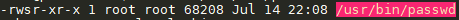

# About SETUID

## What is SETUID
The setUID bit allows for a user to run a program as a different user. The user that the program runs as will be the owner of the file that has the SUID bit set.

## How to identify SETUID

Files with SUID set can be identified by looking at the file permissions.
EG: `ls -l /usr/bin/passwd`

```shell
-rwsr-xr-x 1 root root 68208 Jul 14 22:08 /usr/bin/passwd
```

Notice how the user permissions contain an `s` where `x` should be? If your terminal supports color than the file will normally also be red or be highlighted with red.
[]()

To find files with SUID you can run the following command.

```shell
sudo find <DIRECTORY> -user root -perm -4000 -exec ls -ldb {} \;
```


# Source Resources

[GTFO BINS](https://gtfobins.github.io/)

[TryHackMe! Abusing SETUID Binaries - Vulnversity](https://www.youtube.com/watch?v=hvYWCegfEZs)

[Linux SetUID, SetGID, Sticky Bit](https://www.youtube.com/watch?v=2gHp_CgUets)